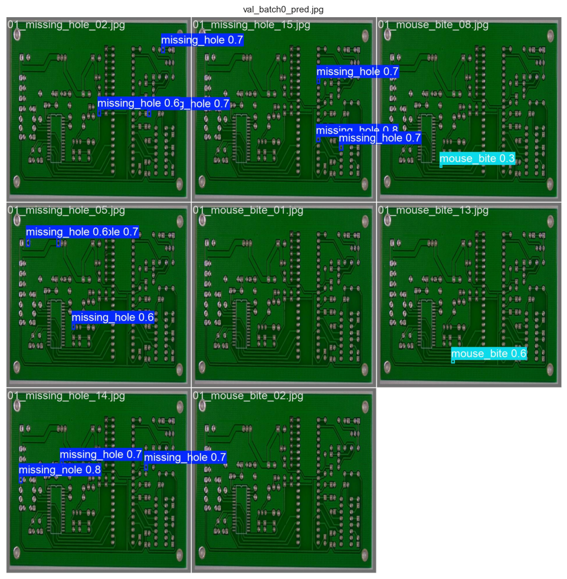
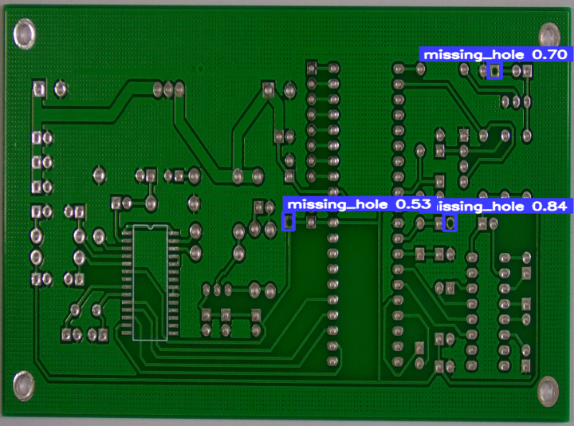
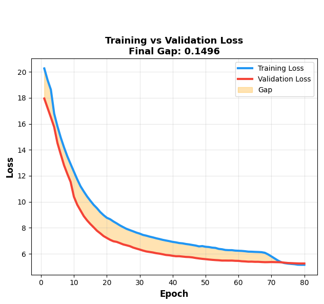
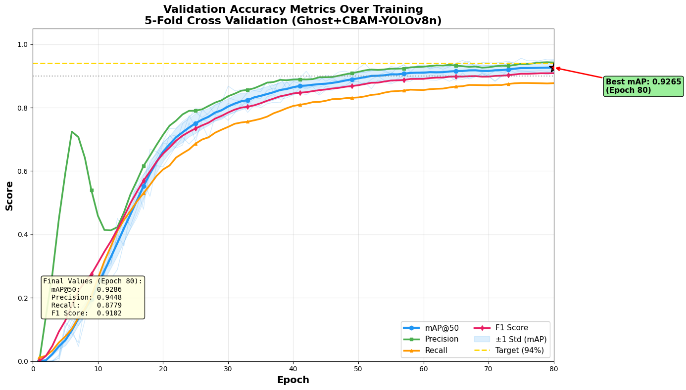
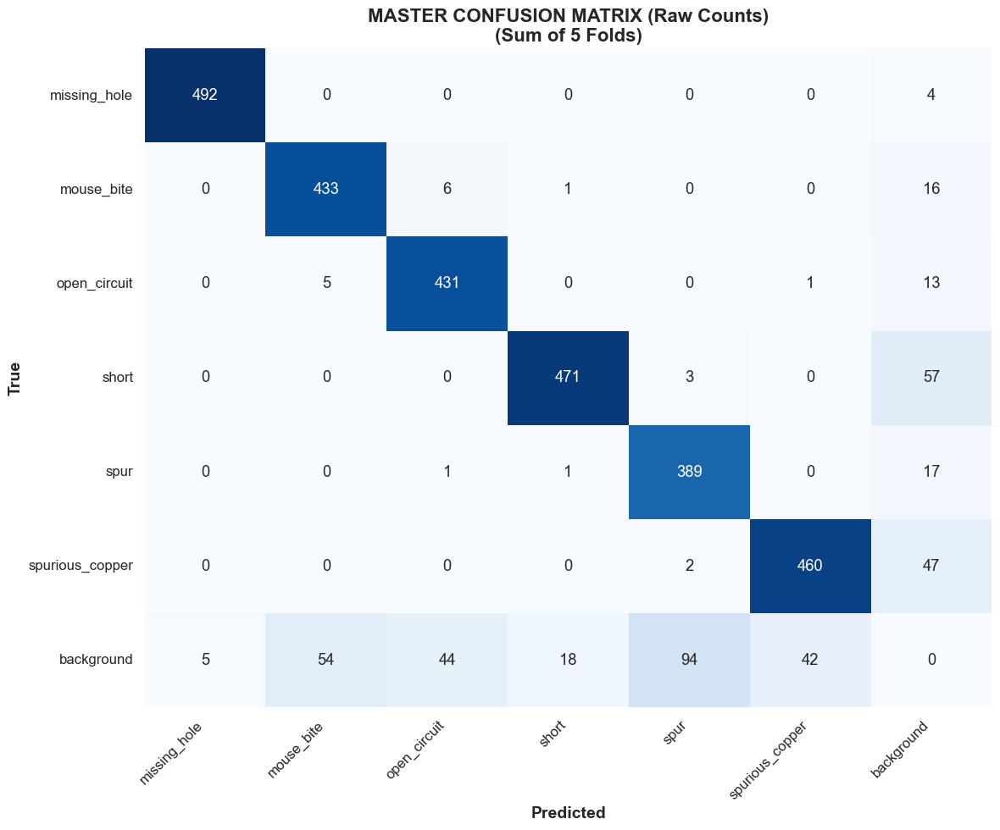

#  PCB Defect Detection using YOLOv8 (GhostConv + CBAM)

##  Overview

This project focuses on detecting defects in Printed Circuit Boards (PCB) using a customized YOLOv8 deep learning model. The model is enhanced with Ghost Convolution and CBAM attention mechanisms to improve detection accuracy while maintaining efficiency.

---

##  Key Features

* Custom YOLOv8 architecture:

  * Ghost Convolution (lightweight feature extraction)
  * CBAM Attention (better focus on defects)
* XML to YOLO dataset conversion pipeline
* 5-Fold Cross Validation for robust training
* Performance evaluation using:

  * mAP (Mean Average Precision)
  * IoU (Intersection over Union)
  * Confusion Matrix
* INT8 Quantization for edge deployment
* Feature map and attention visualization

---


##  Dataset

Due to size limitations, the dataset is not included.

 Download Dataset: https://www.kaggle.com/datasets/akhatova/pcb-defects/data

### Classes:

* missing_hole
* mouse_bite
* open_circuit
* short
* spur
* spurious_copper

---

##  Training Details

* Model: YOLOv8 (custom modified)
* Input size: 512
* Loss: BCE + Focal Loss
* Cross-validation: 5-Fold

---

##  Results

###  Sample Predictions




###  Training Graphs





###  Confusion Matrix



##  Tech Stack

* Python
* PyTorch
* Ultralytics YOLOv8
* OpenCV
* NumPy
* Matplotlib
* Scikit-learn

---

##  How to Run

```bash
pip install -r requirements.txt
```

Run notebook:

```bash
jupyter notebook
```

---

##  Future Work

* Real-time PCB inspection system
* FPGA / Edge deployment
* Industrial automation integration
